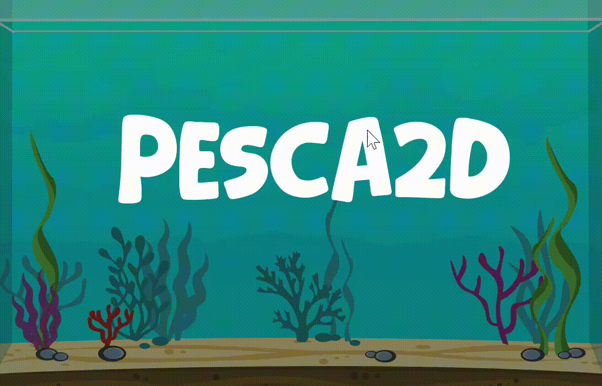

# 🎣 Proyecto: Juego de Pesca 2D

> Un mini-juego arcade de pesca, sistema de recompensas y una mecánica de puntuación basada en el peso del pez. 



---

## ✨ Características Principales
- 🧠 Sistema de puntuación con peso: cada pez tiene un rango de peso y su puntaje final se calcula con un multiplicador.
- 🎯 Mecánica de recompensa: manten el contacto con el pez para obtener una recompensa.
- 🕹️ Controles accesibles: lanzamiento, control de barra y salto.
- 🎛️ HUD claro: intentos usados, puntos totales y tiempo/contácto durante el reto.
- 🚥 Transiciones suaves: instrucciones iniciales, victoria/derrota por intento y pantalla final con reinicio.

---

## 🎮 Cómo Jugar
- Objetivo: Alcanzar 1000 puntos en 5 intentos, con máximo 3 fallos.
- Flujo:
  1. Presiona `Enter` en la pantalla de inicio
  2. Lee las instrucciones rápidas
  3. En el juego, lanza con `Space`, controla con `Up`/clic, y completa el reto de contacto para capturar peces
  4. Reclama tu recompensa y continúa hasta ganar o perder

### Controles
| Acción | Tecla |
|-------|------|
| Lanzar caña / iniciar animación | `Space` |
| Control de barra / salto del cuadrado | `Up` o `Click Izquierdo` |
| Continuar / Confirmar / Reiniciar | `Enter` |

-### Meta
- Alcanzar `1000` puntos dentro de `5` intentos
- Máximo `3` fallos

---

## 🐟 Sistema de Peces
Cada pez tiene:
- Nombre y rareza
- Puntos base
- Rango de peso (kg)
- Multiplicador calculado por la posición del peso dentro del rango

Ejemplo de tabla (referencial):

| Nombre | Rareza | Puntos Base | Rango de Peso |
|--------|--------|-------------|---------------|
| Pez Dorado | Épico | 240 | 1–5 kg |
| Pez Rojo | Raro | 180 | 4–12 kg |
| Pez Azul | Común | 120 | 8–25 kg |
| Pez Verde | Común | 100 | 8–25 kg |

### Ejemplos de puntuación
- Pez Dorado de 4.5 kg (rango 1–5): multiplicador alto → puntos finales mayores
- Pez Verde de 9 kg (rango 8–25): multiplicador bajo → puntos finales más modestos

---

## 🏆 Sistema de Puntuación
- Fórmula actual (según código):

Puntos Finales = Base × (0.7 + (porcentaje_del_peso × 0.8))

Donde:
- `porcentaje_del_peso = (peso_actual - peso_min) / (peso_max - peso_min)`
- Rango del multiplicador: `0.7` (peso mínimo) a `1.5` (peso máximo)

### Ejemplo
- Pez con Base = 200 pts, Rango 10–20 kg, Peso capturado = 15 kg
- `porcentaje = (15 - 10) / (20 - 10) = 0.5`
- `multiplicador = 0.7 + (0.5 × 0.8) = 1.1`
- `Puntos Finales = 200 × 1.1 = 220 pts`

### Estrategia para ganar
- Busca el mayor contacto posible con el pez para obtener peces.
- Azar en peces con mayor Base y rangos que favorecen multiplicadores altos.
- Minimiza fallos para aprovechar los 5 intentos.


---

## 🛠️ Instalación/Ejecución
Requisitos:
- Windows
- Compilador C++ (MinGW/Visual Studio)
- SFML 2.5+

### Makefile: limpiar, compilar y ejecutar
El proyecto incluye un `makefile` con tareas comunes:

- `make clean`: elimina binarios y artefactos de compilación.
- `make`: compila el proyecto y genera el ejecutable en `bin/`.
- `make run`: compila (si es necesario) y ejecuta el juego automáticamente.

#### Uso en PowerShell (Windows)
```powershell
make clean
make
make run
```

Si prefieres ejecutar manualmente después de compilar:
```powershell
make
.\bin\JuegoPesca2D.exe
```


---

## 📁 Estructura del proyecto
```
assets/
  Imagenes/ ...
  Musica/ ...
include/
  anzuelo.hpp
  bote.hpp
  peces.hpp
  pescador.hpp
src/
  00_Audio.cpp
  01_Mundo.cpp  <-- bucle principal, estados, HUD, transiciones
  02_Peces.cpp  <-- sistema de recompensas y multiplicadores
makefile
```

---

## 👨‍💻 Autores
- Miguel Aldahi López Chávez
- Gilberto Ibrahim Salcedo Lepe 
- Proyecto escolar / estudiante
- Juego de Pesca 2D desarrollado con SFML

> Contacto y mejoras bienvenidas.
